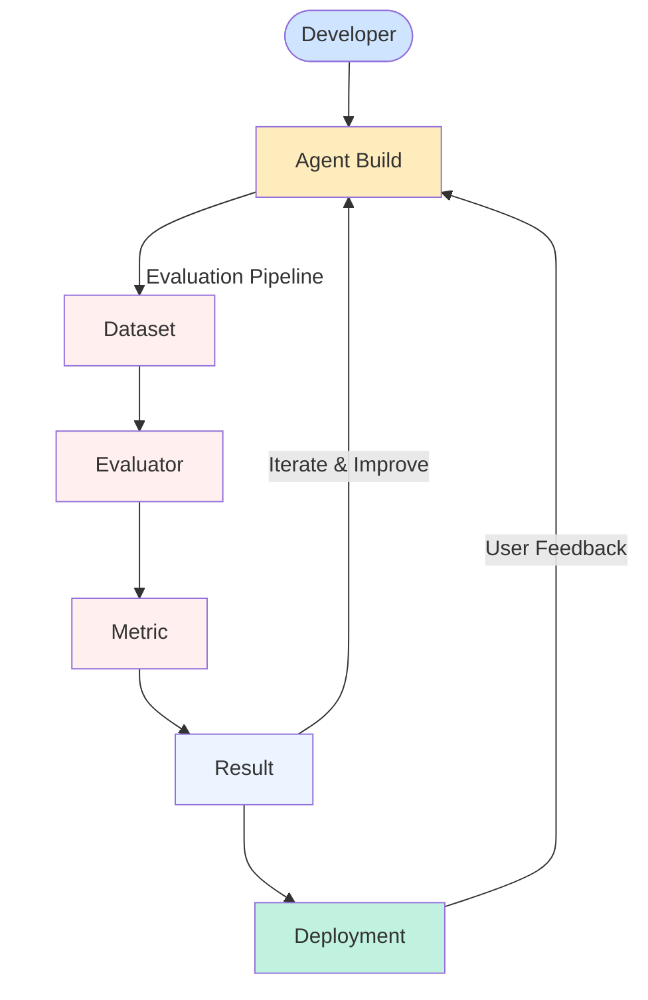

Testing has been an essential part of software engineering lifecycle. While "Agents" are still software products, due to being stochastic in nature, they require evaluation from certain other paradigms which is an active area of research with currently no widespread agreed upon standards. In **Railtracks** we follow the philosophy of continuing to allow flexibility for users to define what "Evaluation of Agents" means to them.

We have set the structural outline below of two potential avenues:

1. Evaluations that analyze the past results of an agent
2. Evaluations that require an agent to be invoked

Currently in **Railtracks** we have focused on providing direct support for the first case and indirect support for the second case. We are actively working on providing APIs for "Agent Experimentation" which is what we believe to be the encompassing term for the second case above.

## Evaluation Flow

The diagram below illustrates a typical evaluation workflow:

